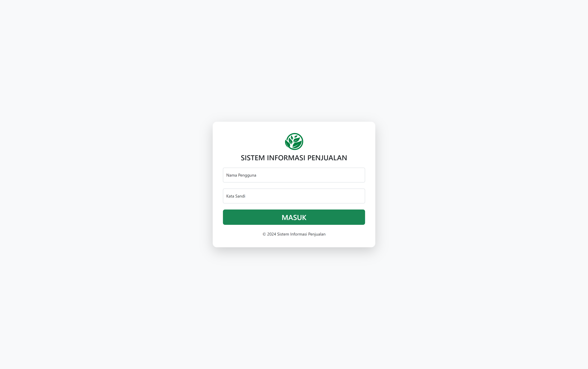
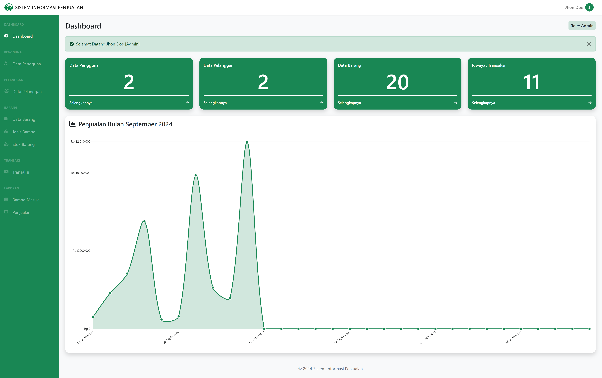
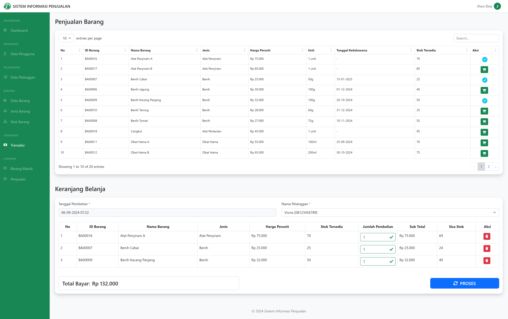

# Point of Sales (POS) - PHP Native

Selamat datang di proyek **Point of Sales (POS) - PHP Native**! 🎉 Ini adalah aplikasi POS yang dibangun menggunakan PHP Native dengan studi kasus **Penjualan Kebutuhan Pertanian**. Aplikasi ini memanfaatkan **Bootstrap 5** untuk styling dan **DataTables** untuk menampilkan data tabel dengan fitur pencarian dan pengurutan yang intuitif.

## 🖥️ Tampilan Aplikasi

### 1. **Login:**


### 2. **Dashboard:**


### 3. **POS:**


## ✨ Fitur Utama

- **Login Multi-User**: Mendukung dua jenis pengguna: Admin dan Kasir.
- **Kelola Users**: Fitur eksklusif untuk Admin untuk mengelola akun pengguna.
- **Kelola Pelanggan**: Hanya dapat diakses oleh Admin untuk mengelola data pelanggan.
- **Kelola Data Barang**: Mengelola daftar barang, jenis barang, stok barang, serta mencetak laporan barang masuk.
- **Kelola Penjualan**: Mengelola transaksi, riwayat transaksi, serta mencetak nota dan laporan transaksi.

## 🔑 Kredensial Login

Gunakan kredensial berikut untuk login ke aplikasi:

- **Admin**:
  - **Username**: `admin`
  - **Password**: `admin`

- **Kasir**:
  - **Username**: `kasir`
  - **Password**: `kasir`

## 🚀 Teknologi yang Digunakan

- **PHP**  : Versi PHP 8.0 atau lebih baru.
- **MySQL**  : Basis data untuk menyimpan data aplikasi.
- **Bootstrap 5**  : Framework CSS untuk desain responsif dan komponen UI.
- **DataTables**  : Plugin jQuery untuk tabel interaktif dengan fitur pencarian dan pengurutan.
- **FontAwesome**  : Kumpulan ikon untuk desain web.

## 📦 Cara Instalasi

1. **Clone Repository**:
    ```bash
    git clone https://github.com/alfian742/pos-website.git
    ```

2. **Masuk ke Direktori Proyek**:
    ```bash
    cd pos-website
    ```

3. **Konfigurasi Database**:
    - Buat database baru di MySQL.
    - Impor file `sip.sql` yang ada di folder proyek ke database baru tersebut.

4. **Sesuaikan Konfigurasi**:
    - Edit file `config.php` untuk menambahkan detail koneksi database Anda.

5. **Jalankan Aplikasi**:
    - Pastikan server web lokal seperti Apache atau Nginx aktif. Contoh perangkat lunak yang dapat digunakan adalah Laragon, XAMPP, atau MAMP.
    - Akses aplikasi melalui browser dengan membuka `http://localhost/pos-website`.

## 📖 Panduan Penggunaan

1. **Login ke Aplikasi**:
    - Masukkan kredensial login yang telah disediakan di bagian **Kredensial Login**.

2. **Jelajahi Menu**:
    - Setelah login, Anda akan dapat mengakses berbagai menu untuk mengelola data dan transaksi sesuai dengan peran Anda (Admin atau Kasir).

---

Terima kasih telah mengunjungi repositori ini! Jika Anda memiliki pertanyaan atau saran, jangan ragu untuk menghubungi saya.
